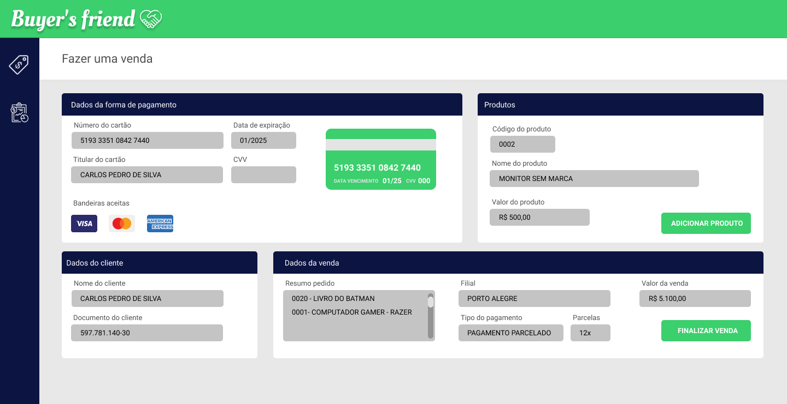
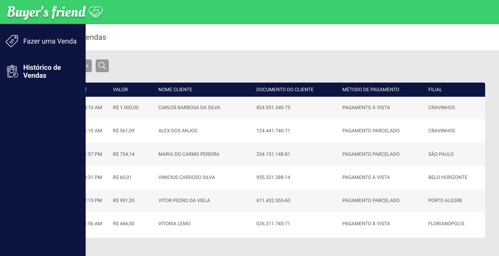

# Buyer's Friend 🤑

# Sobre
Esse é um case técnico destinado a desenvolvedores front end, onde o objetivo é desenvolver parte de um sistema de gestão de vendas para a empresa fictícia Buyer's Friend (amigo do comprador haha).

# Problemática
Você agora faz parte da equipe de desenvolvedores da empresa Buyer's Friend, e seu primeiro desafio é construir parte de um sistema de gestão de vendas que possibilite com que todas as filiais da empresa consigam realizar uma venda e visualizar o histórico de vendas da empresa.

Seguindo o protótipo feito pelo designer da empresa, você deve construir o front end desse sistema com o máximo de fidelidade possível(cores, icones, logos, componentes e funcionalidades).

## Imagens do sistema

### Tela de realizar uma venda


### Tela de histórico de vendas (Menu visível)


# Instruções
Você receberá tudo que precisa para realizar o teste, isso inclui os icones usados, logo, protótipo do sistema(FIGMA) e uma api que irá fornecer os dados de produtos da empresa, filiais e os métodos de pagamento.

O projeto construido deve ser hospedado em um repositório publico do "GITHUB", contendo o projeto e as instruções de uso, após isso você deverá enviar ao seu recrutador o link para o acesso ao repositório para ser avaliado. 

## Casos de uso
1 - O usuário deve conseguir fazer uma venda através da tela "Fazer uma venda", onde ele informará os dados do pagamento do cliente (somente é aceito pagamentos através de cartão), os dados do cliente, os produtos que o cliente está comprando e os dados da venda.

### Dados do pagamento
- Número do cartão
- Titular
- Data de expiração
- CVV

### Dados do cliente
- Nome
- Documento (CPF)

### Produtos
- Código
- Nome
- Valor em R$
- Botão para adicionar um produto ao pedido

### Dados da venda
- Resumo do pedido (Contém todos os produtos adicionados)
- Filial
- Tipo do pagamento (Caso seja "PARCELADO" deve ser exibido o campo "Parcelas")
- Parcelas (Somente se o tipo do pagamento for "PARCELADO")
- Valor da venda (Soma do valor de todos os produtos adicionados)
- Botão para finalizar a venda

2 - O usuário deve conseguir visualizar todas as vendas realizadas pela empresa através da tela "Histórico de vendas", onde ele poderá ordenar os registros por data da venda, nome do cliente e valor da venda, e ainda poderá pesquisar uma venda através do nome do cliente, documento do cliente, tipo de pagamento e filial.

### Dados de uma venda
- Data da venda
- Valor
- Nome do cliente
- Documento do cliente
- Método de pagamento
- Filial

## Requisitos funcionais
- O sistema deve permitir que o usuário adicione produtos a um pedido de uma venda;
- O sistema deve permitir que o usuário remova produtos de um pedido clicando sobre o seu nome "duas vezes";
- O sistema deve permitir o usuário fazer uma venda;
- O sistema deve redirecionar o usuário para a página "Histórico de vendas" quando uma venda for realizada;
- O sistema deve conseguir exibir as vendas realizadas ao usuário quando solicitado;
- O sistema deve permitir que o usuário realize a pesquisa de uma venda;
- O sistema deve permitir que o usuário ordene as vendas de forma decrescente e crescente;
- O sistema deve fornecer os feedbacks adequados para o usuário sobre suas ações realizadas (messagens de sucesso/falha, dados inválidos e etc).

## Requisitos não funcionais
- Responsividade (O sistema deve se adaptar a dispositivos mobile);
- Acessibilidade (O sistema deve permitir a navegação somente pelo teclado, sem o uso do mouse)
- Semantica (Uso correto dos elementos html);
- Uso adequado de seletores CSS para aplicação dos estilos da interface;
- O sistema deve ser contruido usando o framework React;
- Tratamento de excessão adequados, permitindo que o sistema se recupere dos erros;
- Uso adequando dos conceitos de orientação objetos (Caso optar por seguir esse paradigma);
- Uso adequando dos conceitos de programação funcional (Caso optar por seguir esse paradigma);
- Usar o banco local do navegador (IndexedDB) para persistir os dados das vendas;
- O sistema deve possuir validação de dados dos campos do formulário;
- O sistema deve formatar adequadamente os tipos de dados do formulário (CPF, Cartão, data e etc);
- O sistema deve consumir os dados providos pela api;
- O sistema deve armazenar somente o número do cartão "truncado" e o nome do titular do cartão referente aos dados do pagamento do cliente.

*OBS: Cartão truncado, é o número do cartão onde somente os 4 primeiros dígitos e os 4 ultimos dígitos do cartão ficam vicam visiveis, e os restantes dos números são retirados ou substituidos por "\*".*


### Exemplo de uma venda(Persistida no banco local)
```
[
  {
    "id": 1,
    "sale_details": {
      "itens": [
        {
          "id": "0001",
          "name": "COMPUTADOR RAZOR"
        },
        {
          "id": "0002",
          "name": "LIVRO DO BATMAN"
        }
      ],
      "subsidiary": "PORTO ALEGRE"
      "date_sale": "2021-04-01 11:10:20"
      "payment_method": "PAGAMENTO PARCELADO"
      "total_amount_in_cents": 560000
    }
    "client_details": {
      "name": "Carlos Pedro de Silva",
      "document": "59778114030"
    }
    "payment_details": {
      "card_number": "5193********7440",
      "card_holder": "Carlos Pedro de Silva",
    }
  }
]
```

# Considerações finais
A equipe de tecnologia da Cappta lhe deseja um excelente teste, e saiba que seu case técnico será analisado com todo carinho possível por nossos desenvolvedores, assim que analisado retornaremos a você um feedback sobre seu projeto.

Um abraço e até logo/ ou um bem vindo a Cappta! 🖖
